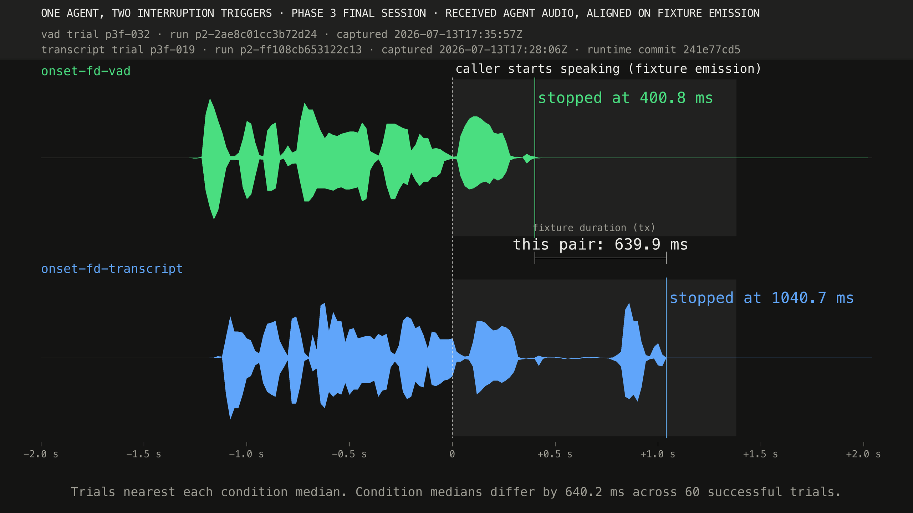
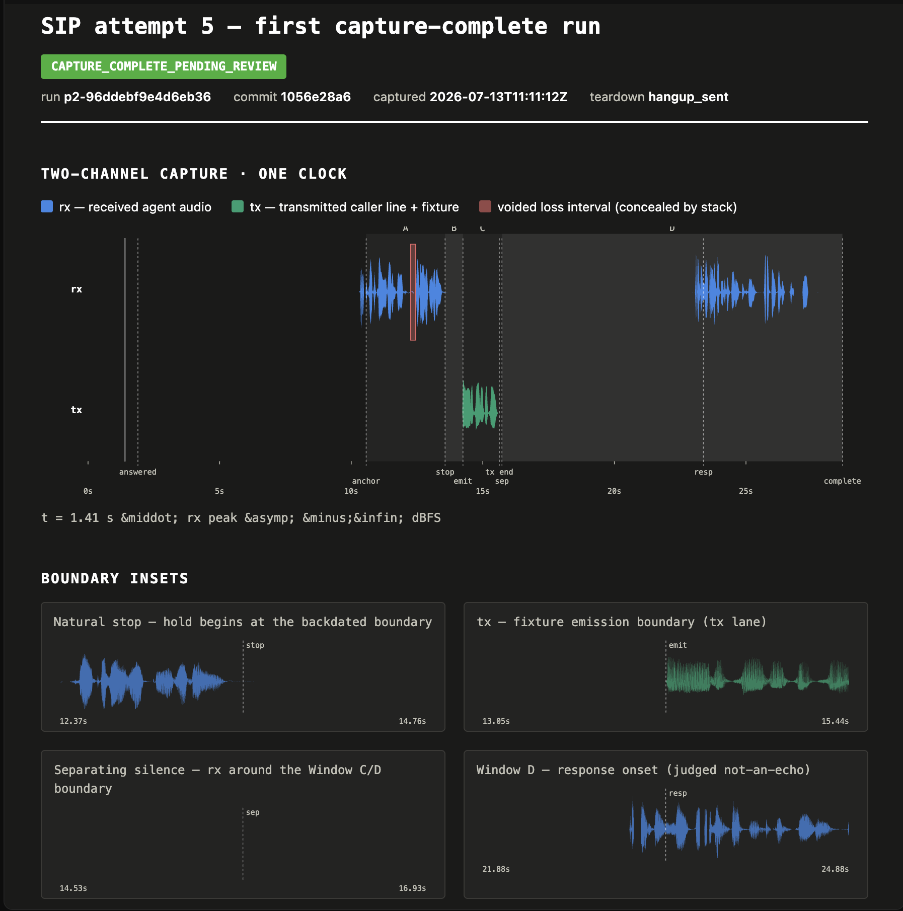

# telnyx-onset

A working Telnyx media-stream voice-agent reference implementation and a
reproducible experimental harness for measuring voice-agent interruption.

> [!IMPORTANT]
> This is a research and reference repository, not a production-ready voice
> service. The agent runs end to end on real calls, and its interruption path has
> been exercised in controlled live-call benchmarks. It is not packaged or
> operated as a highly available, multi-tenant deployment.

The agent uses raw bidirectional audio over the Telnyx Media Streaming WebSocket,
real-time STT and TTS over Telnyx WebSocket services, and frame-level media
clearing for barge-in. The benchmark side of the repository adds a SIP media
endpoint, two-channel capture, acoustic boundary detection, fail-closed trial
classification, frozen manifests, and reproducible analysis.

The full loop—voice transport, STT, TTS, LLM inference, and call control—runs
through one Telnyx control plane and one API key. That does not mean every model
is Telnyx-built: the default NaturalHD TTS voice is a first-party Telnyx engine,
while the default STT engine is Deepgram reached through Telnyx's API.

## Project status

Two related systems live here:

1. **Runnable reference agent (`onset/`)** — answers an inbound PSTN call,
   streams L16 audio, transcribes the caller, runs an LLM and tool loop, speaks
   with Telnyx TTS, and clears queued media on an eligible interruption.
2. **Interruption benchmark (`bench/`)** — places controlled SIP calls, injects
   a synthetic caller fixture during agent playback, captures transmitted and
   returned audio on one harness clock, and compares strict VAD-triggered and
   transcript-triggered interruption.

The ordinary demo defaults to half-duplex turn taking because it is robust to
line and acoustic echo. Full-duplex behavior has been validated live in the
controlled SIP harness, not across arbitrary handsets, speakerphones, rooms, or
acoustic echo cancellers.

## Headline benchmark result

Phase 3 attempted every scheduled call—40 per condition, with no replacement of
failed or ineligible trials. Among successful eligible trials, strict local VAD
stopped returned agent audio a median **640.2 ms earlier** than waiting for the
first eligible transcript.

| Trigger condition | Attempted | Eligible | Successful | Median stop latency |
|---|---:|---:|---:|---:|
| Strict local VAD | 40 | 35 | 32 | 400.7 ms |
| Strict transcript | 40 | 33 | 28 | 1040.9 ms |



The plotted trials are nearest their condition medians; the headline medians
come from all 60 successful eligible trials. This is an implementation- and
fixture-specific comparison, not evidence that every VAD beats every STT engine.
It is also not a physical-device or speakerphone AEC study. See the
[Phase 3 report](bench/PHASE3_REPORT.md) for the complete result, eligibility
rules, failures, intervals, and local action-path decomposition.

## Why there is a harness

Measuring when an API command was sent is not the same as measuring when returned
agent audio actually stopped. Phase 2 therefore built a SIP media endpoint that
records transmitted fixture audio and received agent audio on one host clock,
tracks packet loss and concealed intervals, and rejects ambiguous captures.



The capture above is the first run that reached
`CAPTURE_COMPLETE_PENDING_REVIEW`. It shows why the repository contains more
measurement and evidence code than agent-runtime code: the benchmark preserves
transport failures, natural pauses, loss intervals, echo checks, and rejected
trials instead of retrying until a clean-looking result appears. The detailed
method is in the [benchmark plan](BENCHMARK_PLAN.md),
[SIP harness specification](bench/SIP_HARNESS_SPEC.md), and
[Phase 2 report](bench/PHASE2_REPORT.md).

## Agent architecture

The reference agent uses three sockets and one API key:

1. **Media socket (`onset/media.py`)** — Telnyx connects to `/ws/media`; inbound
   L16 frames enter the agent and paced L16 frames return to the caller. A
   `clear` event invalidates local queued media and flushes Telnyx playback.
2. **STT socket (`onset/stt.py`)** — raw L16/16 kHz caller frames go to Telnyx
   Speech-to-Text, using Deepgram by default. Interim, final, and speech-final
   events drive turn assembly and the transcript-trigger benchmark condition.
3. **TTS socket (`onset/tts.py`)** — text goes to Telnyx Text-to-Speech; the MP3
   response is incrementally decoded to PCM16 and paced into the media socket.

A local WebRTC VAD can request interruption before STT produces text. One
response generation owns its LLM/TTS task, media epoch, clear action,
cancellation, mark completion, and teardown so late work cannot resume a dead
turn. Strict benchmark modes make either VAD or transcript events exclusively
eligible while recording the other source as inert observation data.

Audio is L16/16 kHz end to end after TTS decode. No application-level resampling
is needed; MP3-to-PCM decoding is the only transcode in the agent loop.

## Repository map

| Path | Purpose |
|---|---|
| `onset/` | Reference voice agent, Telnyx clients, media path, tools, and benchmark instrumentation |
| `bench/` | SIP harness, capture and acoustic analysis, live runners, frozen manifests, and reports |
| `tests/` | Offline coverage for the agent, harness, classifiers, provenance gates, and failure paths |
| `docs/` | Publication handoff, sanitized plotting data, renderer inputs, and figures |
| `scripts/` | Live Telnyx socket probes and streaming-TTS validation |
| `DISCOVERY.md` | Protocol findings, architecture decisions, and vendor/model attribution |
| `BENCHMARK_PLAN.md` | Preregistered benchmark design and analysis policy |

Raw call audio, detailed session evidence, credentials, phone numbers, and
webhook URLs are intentionally gitignored. Committed reports, manifests, CSVs,
and figures are sanitized publication artifacts.

## Production readiness and non-goals

What has been demonstrated:

- Real inbound PSTN call setup through a Voice API / Call Control application.
- Bidirectional L16 media streaming, STT, LLM/tool execution, TTS, and clean
  socket teardown.
- Half-duplex reservation-demo conversations on a real phone call.
- Controlled full-duplex interruption qualification and an 80-call final
  comparison using a synthetic SIP fixture.
- Fail-closed evidence capture, deterministic trial ordering, write-once
  manifests, and reproducible aggregate analysis.

What this repository does not provide as a production service:

- Deployment manifests, autoscaling, high availability, or zero-downtime
  rollout support.
- A persistent reservation backend, durable call state, tenant isolation, or an
  administrative API.
- Capacity claims beyond limited concurrent-call smoke testing.
- Production monitoring, alerting, SLOs, incident runbooks, or cost controls
  beyond basic per-call limits.
- Broad handset, carrier, speakerphone, room, and acoustic echo cancellation
  validation.
- A stable public SDK/CLI or compatibility guarantees for the benchmark
  artifact schemas.

Treat `onset/` as a concrete implementation to study and extend, and `bench/` as
the stronger claim: a controlled, inspectable way to measure this implementation.

## Setup

Python 3.12+ and [uv](https://docs.astral.sh/uv/) are required.

```bash
uv venv --python 3.12 .venv
uv pip install --python .venv/bin/python -e ".[dev]"
cp .env.example .env
```

Fill in the Telnyx credentials and identifiers in `.env`. Use a **Voice API /
Call Control application**, not a TeXML application. Assign the phone number to
that application, point its webhook at `https://<public-host>/webhook`, and set:

```dotenv
MEDIA_STREAM_URL=wss://<public-host>/ws/media
```

An ngrok or cloudflared tunnel is sufficient for local development.

## Run a demo call

Start the server:

```bash
.venv/bin/python -m onset
```

Then call the assigned Telnyx number. The Golden Fork demo greets the caller,
collects date, time, party size, and name, checks availability, creates a
deterministic demo confirmation, reads it back, and ends the call.

The default is `HALF_DUPLEX=true`. Set `HALF_DUPLEX=false` only when the live
audio path is known to be sufficiently echo-free for local VAD barge-in.

## Validate or reproduce the benchmark

Start with the offline repository gate; it places no calls:

```bash
.venv/bin/python -m pytest -q
.venv/bin/ruff check onset bench tests
.venv/bin/mypy onset bench tests
```

The final aggregate can be reproduced where the original ignored raw session
artifacts are present:

```bash
.venv/bin/python -m bench.phase3_analysis \
  --session bench/artifacts/phase3_final_session.json \
  --artifact-root bench/artifacts \
  --output /tmp/phase3-final-analysis-reproduced.json
```

A fresh clone contains the sanitized reports, frozen manifests, plotting table,
and figures, but not raw audio or detailed call evidence. Running a new live
campaign requires dedicated agent and harness numbers, two Call Control
applications, SIP credentials, a public tunnel, the synthetic fixture, and a
working `pjsua2` installation. It places billable calls and temporarily leases
the agent application's webhook, restoring it in a `finally` path.

Before any live run, read the [Phase 3 preparation notes](bench/PHASE3_PREP.md),
[SIP harness specification](bench/SIP_HARNESS_SPEC.md), and frozen
[measurement profile](bench/measurement_profile.json). The live runners require
an explicit `--live` flag and `BENCH_LIVE=1`; they also reject dirty revisions,
profile mismatches, reused artifact paths, and invalid manifest provenance.

## Further reading

- [Discovery and protocol findings](DISCOVERY.md)
- [Benchmark plan](BENCHMARK_PLAN.md)
- [Phase 2 acoustic-boundary report](bench/PHASE2_REPORT.md)
- [Phase 3 execution report](bench/PHASE3_REPORT.md)
- [Phase 3 publication handoff](docs/phase3-blog-handoff.md)
